# **Deploying JFrog Artifactory with Rancher**

[JFrog Artifactory](https://jfrog.com/artifactory/) is a Universal Repository Manager supporting all major packaging formats, build tools and Continuous Integration servers. It is a scalable universal binary repository manager that automatically manages your artifacts and dependencies through the application development and delivery process.

In this article you will see how you can deploy and manage JFrog Artifactory on a Kubernetes cluster with the help of Rancher. At the end of this article you will have a fully functional [JFrog Artifactory OSS](https://jfrog.com/open-source/) (Open Source Solutions). The same steps can be used to install a licensed version of Artifactory. You will see how you can create a generic repository in Artifactory and upload an artefact to it. Artifactory has much more features besides the ones presented in this article, but the purpose of this article is to show how you can easily install Artifactory onto a Kubernetes cluster with the help of Rancher.

In a further article, I will describe some of the features of Artifactory and how to use them.

#### **Software versions used**

At the time of writing, the software versions used for this article were the followings:
- Rancher v2.0.8;
- Kubernetes cluster running on Google Kubernetes Engine version 1.10.7-gke.2;
- Artifactory helm chart version 7.4.2;
- Artifactory OSS version 6.3.2

There are multiple ways to install Artifactory. Here I'm using a Helm chart to deploy Artifactory on a Kubernetes Cluster, and that Kubernetes cluster is deployed with Rancher. The question arises - why bother use Rancher at all? While you can install an artifactory helm chart by just using kubectl/helm, using Rancher provides quite some benefits:
- an easy to use web user interface;
- simple overview of the whole cluster, or multiple clusters;
- out of the box monitoring of your cluster(s);
- workload, RBAC, policy and project management;
- use all the power of kubernetes without the need to install any software locally, all you need is just a browser.

Let's start the fun.

#### **Starting a Rancher instance**

The first step is to start the Rancher instance, that will help you install your artifactory repository. Below are the outlined steps to easily start a stand-alone Rancher instance, running from a docker container.

First step is to create a virtual machine instance on your favourite Cloud Platform. In this article I am using Google Cloud Platform with a small instance of Ubuntu 18.04. That one can be easily started from the Google Cloud Platform Console or from command line with the following command:

```
gcloud compute --project=rancher-20 instances create rancher-instance \
 --zone=europe-west2-c \
 --machine-type=g1-small \
 --tags=http-server,https-server \
 --image=ubuntu-1804-bionic-v20180911 \
 --image-project=ubuntu-os-cloud
```

Please make sure to change the `project` and `zone` parameters to your needs. After a couple of moments you should see a similar output:

```
Created [https://www.googleapis.com/compute/v1/projects/rancher-20/zones/europe-west2-c/instances/rancher-instance].
NAME              ZONE            MACHINE_TYPE   INTERNAL_IP  EXTERNAL_IP     STATUS
rancher-instance  europe-west2-c  g1-small       10.154.0.2   35.242.185.165  RUNNING
```

Take note of the `EXTERNAL_IP` from the above output, you will need it to connect to the rancher instance.
Now it's time to SSH into the instance and start Rancher. To do that type the following command:

```
gcloud compute ssh \
--project "rancher-20" \
--zone "europe-west2-c" \
"rancher-instance"
```

Again, please make sure that `project` and `zone` parameters, reflect your set up.

Once connected, you need to run the following commands, one by one:
```
sudo apt-get update
sudo apt-get -y install apt-transport-https ca-certificates curl software-properties-common
curl -fsSL https://download.docker.com/linux/ubuntu/gpg | sudo apt-key add -
sudo apt-key fingerprint 0EBFCD88
sudo add-apt-repository "deb [arch=amd64] https://download.docker.com/linux/ubuntu $(lsb_release -cs) stable"
sudo apt-get update
sudo apt-get -y install docker-ce
```

These will install Docker on your VM, we will use it to start Rancher. The next line will start Rancher in a docker container and expose it's web UI on `HTTP` and `HTTPS`:

```
sudo docker run -d --restart=unless-stopped -p 80:80 -p 443:443 rancher/rancher
```
You will see something like the below output. Once it provides you with the hash of the container, it means it started successfully.
```
Unable to find image 'rancher/rancher:latest' locally
latest: Pulling from rancher/rancher
124c757242f8: Pull complete
2ebc019eb4e2: Pull complete
dac0825f7ffb: Pull complete
82b0bb65d1bf: Pull complete
ef3b655c7f88: Pull complete
437f23e29d12: Pull complete
52931d58c1ce: Pull complete
b930be4ed025: Pull complete
4a2d2c2e821e: Pull complete
9137650edb29: Pull complete
f1660f8f83bf: Pull complete
a645405725ff: Pull complete
Digest: sha256:6d53d3414abfbae44fe43bad37e9da738f3a02e6c00a0cd0c17f7d9f2aee373a
Status: Downloaded newer image for rancher/rancher:latest
454aa51a6f0ed21cbe47dcbb20a1c6a5684c9ddb2a0682076237aef5e0fdb3a4
```

 Remember that `EXTERNAL_IP` from earlier? You need it now, open your browser and go to `https://EXTERNAL_IP/`. At first you should see a certificate error from your browser - that's nothing to worry about, because your Rancher instance doesn't have a valid certificate, but you know it's yours as you've just created it, thus go ahead and proceed to your page. This will present you with the `Welcome to Rancher` screen, where you should set a password for Rancher:

 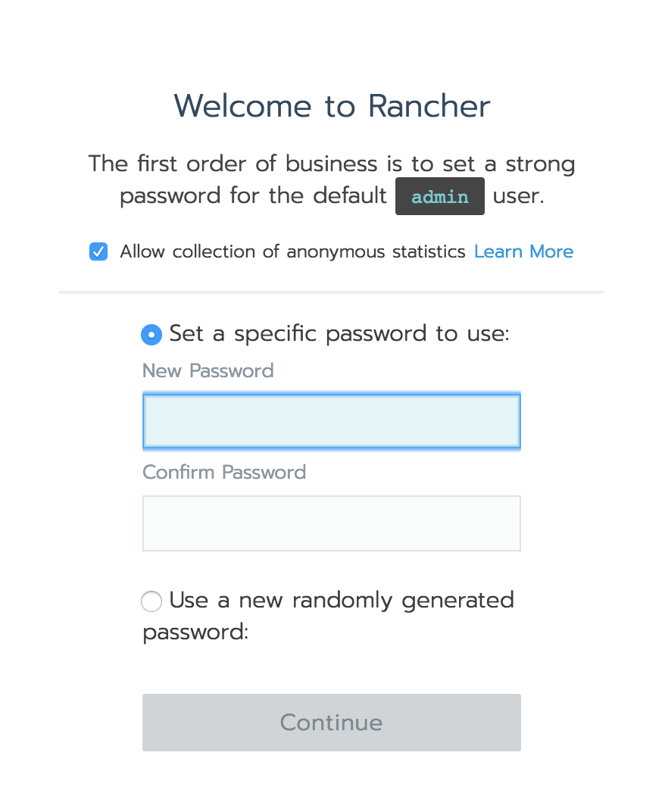

 The next screen asks you to set your `Rancher Server URL`, that can be something like `rancher.yourcompany.com`, for this demo, you can leave it with the `EXTERNAL_IP` address from the above:

 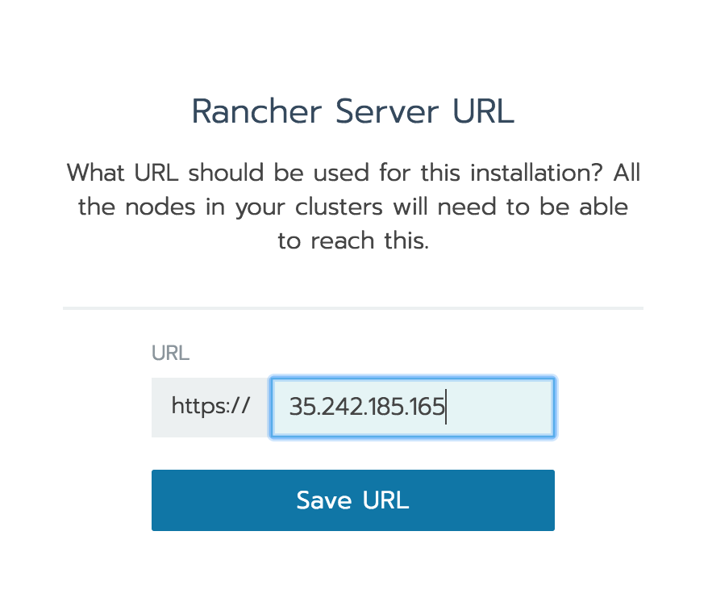

 Click confidently on `Save URL` and you will get into the `Clusters` page of Rancher, here's where you will add your Kubernetes Cluster.

 #### **Adding Kubernetes Cluster via Rancher**

 Click on `Add Cluster` and you will be presented with the options to choose where would you like to create your Kubernetes Cluster. As mentioned above, in this article a Kubernetes cluster running on Google Kubernetes Engine version 1.10.7-gke.2 will be used, thus Google Container Engine is selected.

 Set the name to something intuitive to this demo, like `jfrog-artifactory`.

 To create the cluster, Rancher needs permissions to Google Cloud Platform, those permissions are granted via Service Account private key JSON file. To get that, first find the service account name (replace the `project` name with yours):

 ```
 gcloud iam service-accounts list --project rancher-20

NAME                                    EMAIL
Compute Engine default service account  <SA>-compute@developer.gserviceaccount.com
 ```

 then create the key for it:

 ```
 gcloud iam service-accounts keys create ./key.json \
      --iam-account <SA>-compute@developer.gserviceaccount.com
 ```

**Note**: replace `<SA>` with your service account number, from the `gcloud iam service-account list` command

 This will create a file `key.json` in current directory, this is the Service Account private key Rancher needs to create the Cluster:

 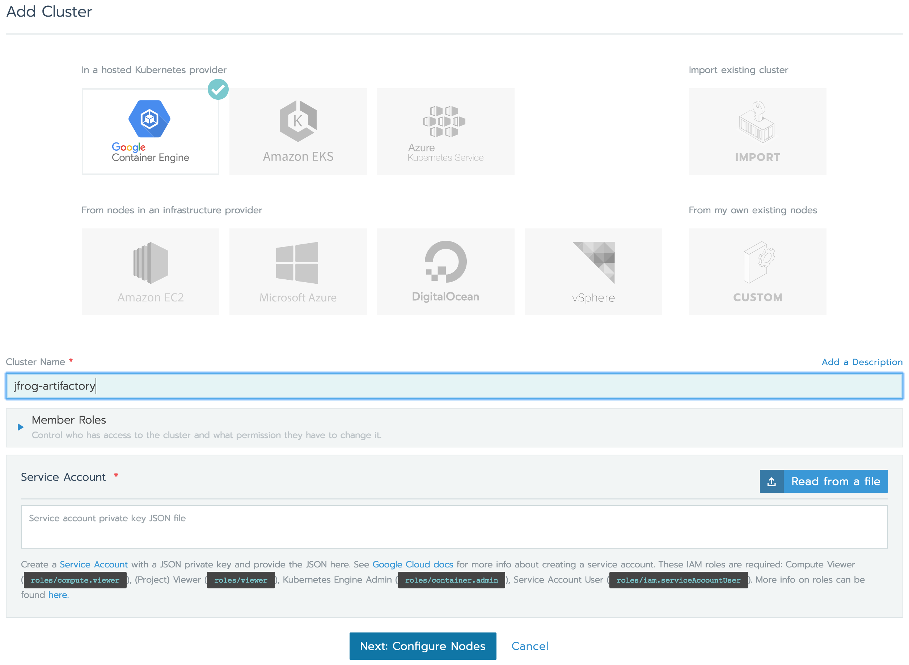

 Once you click on `Read from a file` and point to your `key.json` file, that you've just created, Rancher will present you with the next step to configure your Cluster:

 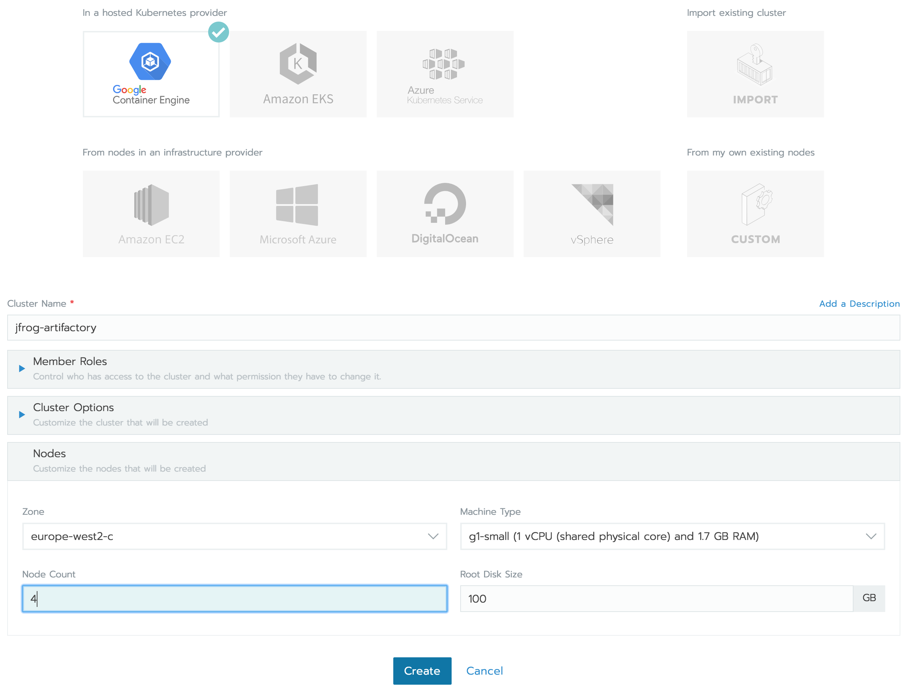


Set your preferred `Zone`, `Machine Type`, `Node Count` and `Root Disk Size`. The values presented in the above screenshot should be fine.

Now click on `Create`. This will start provisioning your cluster in Google Cloud Platform, based on the above specifications, and in a couple of moments you should see your cluster active:

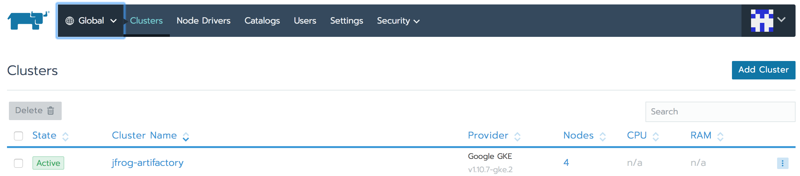


#### **Adding a Catalog to Rancher**

The easiest way to install JFrog Artifactory is to use [Helm charts](https://helm.sh/), these are present in the form of `Catalog Apps` in Rancher. JFrog provides an official repository of Helm charts for Artifactory and to use them, you need to add that repository to Rancher's Catalog.

To do this, click on `Catalogs` in the Global Cluster view of Rancher and then click on `Add Catalog`, you will be presented with the Add Catalog window. Fill the values as follows:
- set the name to something intuitive, like `jfrog-artifactory`;
- set the repository to the official repository `https://charts.jfrog.io`;

Then click on `Create`:

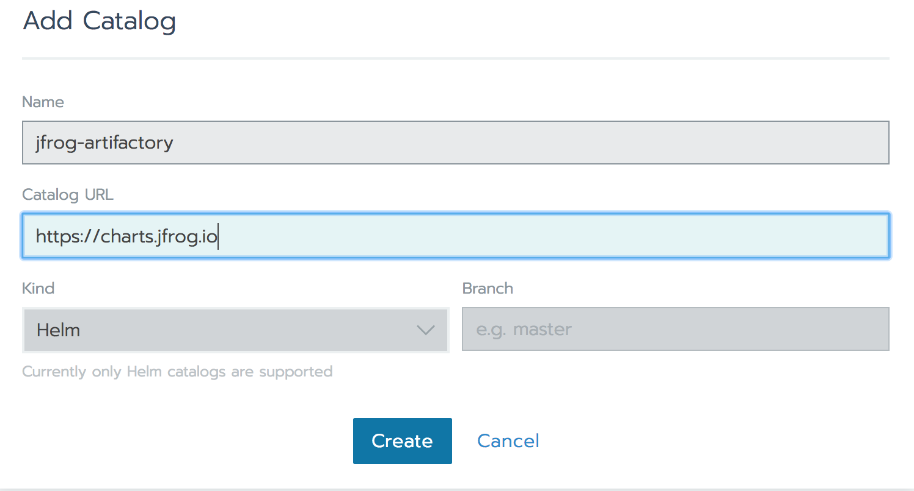

If everything is fine, it should appear in the list of Catalogs:

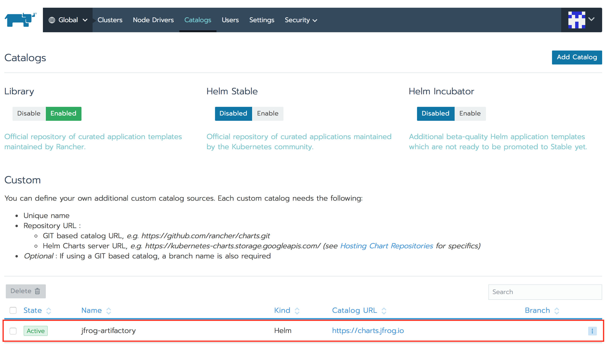

#### **Deploying Artifactory**

At this stage, everything is prepared to deploy Artifactory. From the `Global` view, select the `Default` project, under the `jfrog-artifactory` cluster:

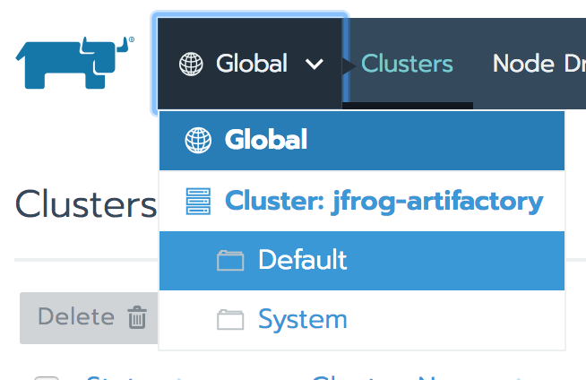

Now click on `Catalog Apps`, and then click on `Launch`. Here you will be presented with the available apps from the Catalogs added to Rancher. The one that you're interested in is the `artifactory (from Jfrog-Artifactory)`, which is the one you just added:

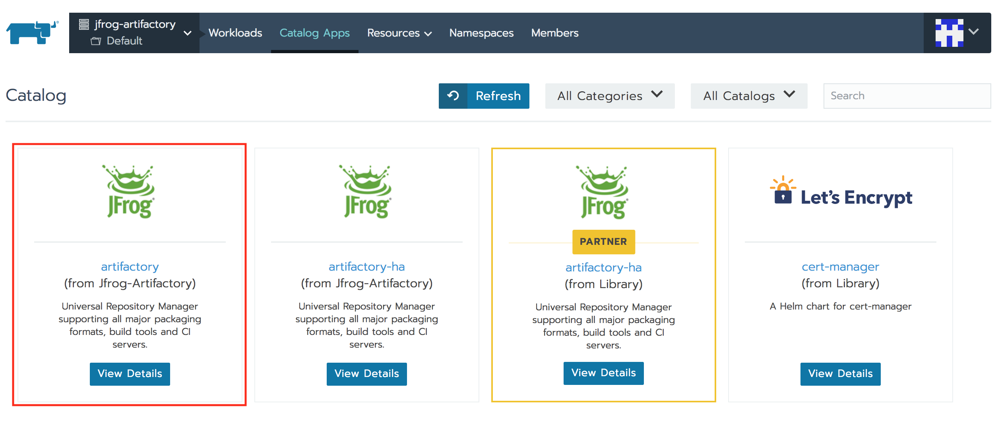

Click on `View Details` and view the presented options. If you leave everything as it is, it will deploy a `Pro` version of Artifactory, that requires a license (there are 30 days trial licenses available). If you have a license, then don't change anything and just click `Launch`.

If you want the Open Source version, then you just need to specify the Open Source version of the container to use. To do that click on `Add Answer` and:
- set the variable name to `artifactory.image.repository`;
- set the value to `docker.bintray.io/jfrog/artifactory-oss`

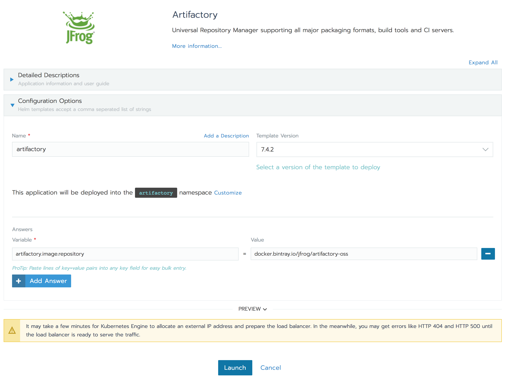

Now click on `Launch`. If everything is fine, you should see something like in the following screenshot:

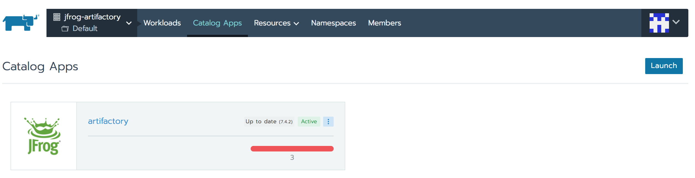

In a couple of minutes, that red line should become green, this means that the application is deployed. If you click on `artifactory` it will present you with the resources that were created for you, to deploy Artifactory. In this case, it created 3 `workloads`, 3 `services`, 1 `volume` and 1 `secrets` objects in Kubernetes.

By clicking on `Workloads`, you should see all of them running:

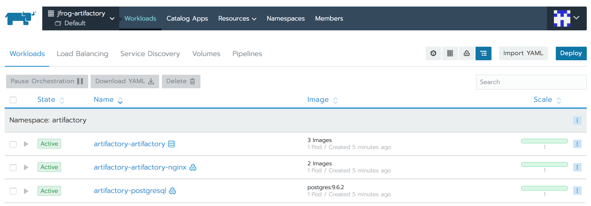

Click now on `Load Balancing` and if you see that resource in `Pending` state, like in the screenshot below:

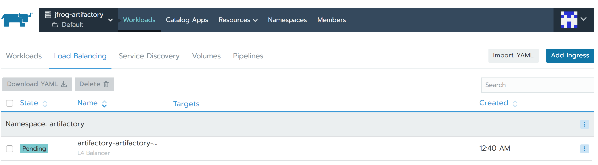

Then there's a misconfiguration somewhere. To fix that, apply the following YAML, by clicking on `Import YAML` in the upper right corner:

```
apiVersion: v1
kind: Service
metadata:
  labels:
    app: artifactory
    chart: artifactory-7.4.2
    component: nginx
    heritage: Tiller
    io.cattle.field/appId: artifactory
    release: artifactory
  name: artifactory-artifactory-nginx
  namespace: artifactory
spec:
  externalTrafficPolicy: Local
  ports:
  - name: nginxhttp
    port: 80
    protocol: TCP
    targetPort: 80
  - name: artifactoryhttps
    port: 443
    protocol: TCP
    targetPort: 443
  selector:
    app: artifactory
    component: nginx
    release: artifactory
  sessionAffinity: None
  type: LoadBalancer
```

Just copy and paste the above YAML and click on `Import`:

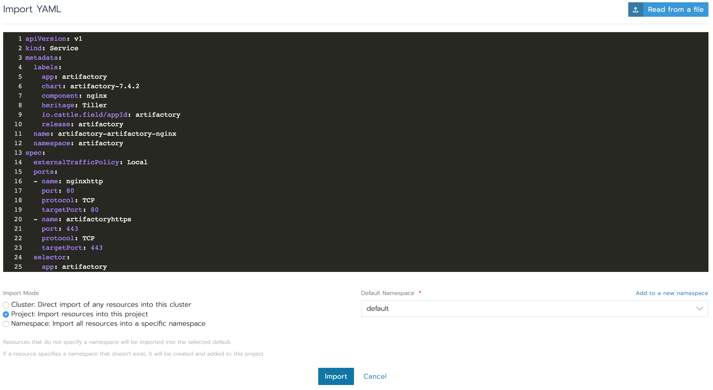

This should fix the Load Balancer, and now if you click on `Workloads`, you should see clickable port numbers `443/tcp` and `80/tcp`, under `artifactory-artifactory-nginx` workload:

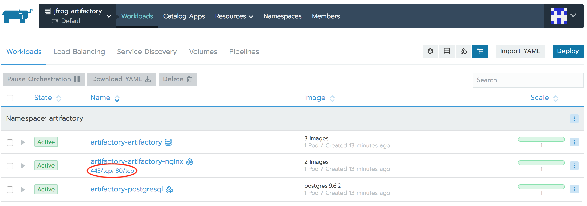

Click on `443/tcp` and it should open Artifactory in a new browser tab (ignore the certificate error from the browser). You should be presented with `Welcome to JFrog Artifactory` page:

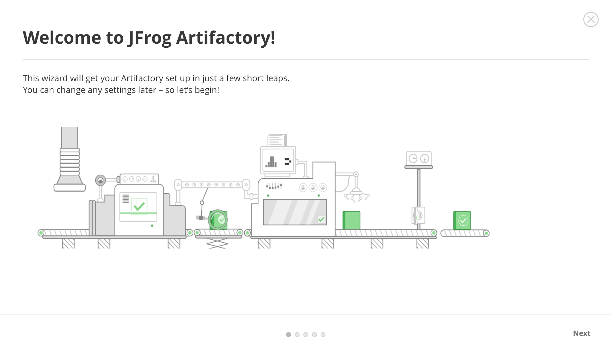

#### **Playing a little with Artifactory**

Lets go through the setup steps:
- click `Next` and set up a new admin password;
- `Skip` the step where you are asked about a proxy server, it's not applicable here;
- create a generic repository and any other repository you like, the example will use a generic repository;
- click `Finish`.

**That was it**, you have an `Artifactory` running on a Kubernetes cluster, deployed with the help of **Rancher**.

Let's upload the helm chart you used to your newly created `Artifactory`.

On the left side of `Artifactory` you have it's menu, select `Artifacts` from there. You should see the `generic-local` repository, that was created at the setup steps, click on that. Then, from the upper right corner, click on `Deploy` and upload [this](https://charts.jfrog.io/artifactory-7.4.2.tgz) file there:

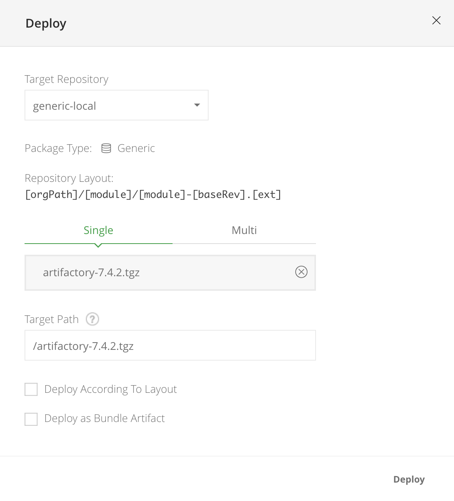

Once you deploy it, you should see it in the tree under your `generic-local` repository:

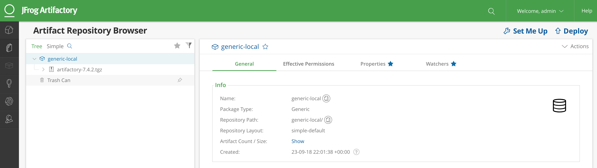

This is a very simple test of Artifactory, that demonstrates that it already can be used to it's full potential.

From this point on, you can use **Rancher** to manage the deployment, to do backups of the volumes Artifactory uses and, of course, use artifactory to speed up your development and release cycles.

#### **Cleanup**

To clean up your cluster resources after this demo, just delete your Kubernetes cluster from Rancher Cluster view and after it's removed, you can also delete the Rancher instance from Google Cloud Platform.

### **Some Final thoughts**

JFrog Artifactory is a very useful application and it seems to get more and more adoption and wider integrations. It becomes a very much needed tool for any company that want's to move fast and deliver fast their apps to their customers.

Using **Rancher** to deploy and manage Artifactory in a Kubernetes Cluster is an easy way to deal with the infrastructure part of Artifactory. You can easily install Artifactory on a Kubernetes Cluster, using official JFrog Helm charts, all in a couple of clicks from **Rancher's** Web UI. There's also a possibility to monitor the resources used, do a backup of the volumes used, and all that from an easy to use Web UI, using just a browser - very convenient.
